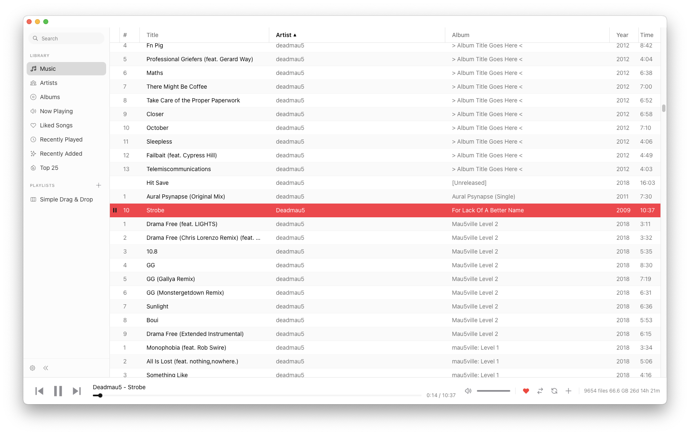

# mt

`mt` is a simple desktop music player designed for large music collections.



## Features

* **Built for large libraries**: virtual scrolling, content-aware reloading, and LRU-cached artwork
* **Cross-platform**: macOS, Linux, and Windows with native media key and OS Now Playing support
* **Themeable**: light, dark, and system themes with customizable columns
* **Playlists and queue management**: drag-and-drop reordering, play next, play history navigation
* **Metadata editing**: read and write tags directly on audio files, including batch editing
* **Watched folders**: multi-directory monitoring with real-time filesystem events, duplicate detection, and move tracking
* **Keyboard-driven**: shortcuts for playback, search, navigation, and type-to-jump by artist
* **Last.fm integration**: scrobbling, now playing, loved track sync, and queued retry on failure

## Minimum Requirements

* OS
  * macOS Sequoia (15.7+)
  * Linux
    * Debian
    * Ubuntu
  * Windows 11 (21H2+)
* [node 24.2.0](https://docs.npmjs.com/downloading-and-installing-node-js-and-npm)
* [rust 1.92.0](https://doc.rust-lang.org/book/ch01-01-installation.html)
  * Be sure to install `rustup`!
* [task](https://taskfile.dev/docs/installation)

## Setup

```bash
# install deps
task npm:install

# run dev server
task tauri:dev
```

## 1.0.0 Highlights

1. **Pure Rust backend** -- complete migration from Python/FastAPI to Tauri commands; Python sidecar removed
2. **Last.fm scrobbling** -- now playing, loved track sync, queued retry on failure, bidirectional love sync
3. **Cross-platform builds** -- macOS code signing and notarization, Windows NSIS installer, Linux AMD64 and ARM64 Docker builds
4. **Virtual scrolling** -- smooth rendering for libraries with tens of thousands of tracks
5. **Artists and Albums views** -- split-pane artist browser and album grid with detail view
6. **Watched folders** -- multi-directory monitoring with real-time filesystem events, duplicate detection, and move tracking
7. **Keyboard shortcuts** -- global playback controls, type-to-jump artist navigation with same-letter cycling
8. **Drag-and-drop playlists** -- reorder tracks, columns, sidebar playlists; library-to-playlist drops
9. **Performance tuning** -- artwork LRU cache, parallel scanning with rayon, SQLite connection pooling, CSS containment
10. **Structured logging and diagnostics** -- tracing-based backend logging, frontend error capture, exportable log files

See the full [release notes](https://github.com/pythoninthegrass/mt/releases) for details.

## Development

See [Builds](docs/builds.md) for build configuration, performance tuning, and signing.

## Credit

* MusicBee for years of rock-solid playback and inspiration to build a subset of its features for other operating systems
* Logo
  * [Music - Sentya Irma](https://thenounproject.com/icon/music-6387002/)
  * [mango tree - Aisyah](https://thenounproject.com/icon/mango-tree-6730625/)

## TODO

See [TODO.md](TODO.md) for a list of features and improvements.
